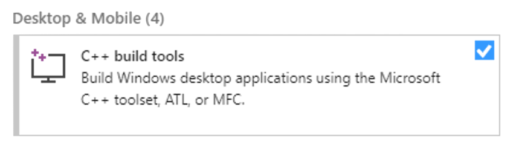

<p align="center">
<br/><br/>
    <a href="https://www.python.org/downloads/" alt="Activity">
        </a>
    <a href="#" alt="Activity">
        </a>
    <a href="#" alt="Activity">
        </a>
    <a href="#" alt="Activity">
        </a>
    </br>
    <a href="https://www.office.com/" alt="Activity">
        </a>
    <a href="https://www.google.com/chrome/" alt="Activity">
        </a>
    <a href="https://www.mozilla.org/en-US/firefox" alt="Activity">
        </a>
    <a href="https://www.microsoft.com/en-us/edge" alt="Activity">
        </a>
    <a href="https://www.opera.com/" alt="Activity">
        </a> 
    <br/>
    <a href="#"></a> 
  <br/><br/>
  

</p>

# This version only includes the Action Logger.

If you want the full tool with process discovery and RPA capabilities, check the [`master` branch](https://github.com/bpm-diag/smartRPA/tree/master).

# Installation and execution:

### 1. **Install dependencies**

[Python](https://www.python.org/downloads/) ≥ 3.7 (_64bit_) is required.

- <details>
  <summary>
      Install <a href="https://visualstudio.microsoft.com/en/thank-you-downloading-visual-studio/?sku=BuildTools&rel=16">Visual Studio C/C++ Build Tools</a> on Windows
  </summary>
  </br>

  

  It is vital to install all C++ related development tools like:

  - Windows 10 SDK
  - Visual C++ tools for CMake
  - C++ x64/x86 build tools

  If you encounter errors like `Microsoft Visual C++ 14.0 is required`, [check here](https://www.scivision.co/python-windows-visual-c-14-required/).

  </details>

- Install [Brew](https://brew.sh) on MacOS
- Install **project** dependencies

  ```bash
  pip3 install -r requirements.txt
  ```

### 2. **Install browser extension**

The browser extension is required to log browser events. It is available in `extensions/browserlogger` and supports 4 major browsers:

- [_Google Chrome_](https://www.google.com/chrome/): load unpacked `browserlogger` directory in `chrome://extensions/`

- [_Mozilla Firefox_](https://www.mozilla.org/en-US/firefox/new/): install [`browserlogger.xpi`](https://github.com/bpm-diag/smartRPA/blob/develop/extensions/browserlogger/browserlogger.xpi?raw=true) in `about:addons`

- [_Microsoft Edge (chromium)_](https://www.microsoft.com/en-us/edge): load unpacked `browserlogger` directory in `edge://extensions/`

- [_Opera_](https://www.opera.com/): load unpacked `browserlogger` directory in `opera:extensions`

Once main logger is running, **you must click** on the browser extension to enable it.

### 3. **Install Excel Addin (MacOS Only)**

The excel addin is required to log Excel events <u>only on MacOS</u>.

[`Node.js`](https://nodejs.org/en/download/) must be installed to run this addin.

```bash
cd extensions/excelAddinMac
npm install # install dependencies
npm start   # sideload Add-in
npm stop    # stop server
```

<details>
<summary>
    Click to show how to <b>activate the Add-in</b> in Excel
</summary>
</br>

<ol type="a">
  <li>Start the Action Logger selecting Excel module</li>
  <li>Go to <code>Insert</code> tab</li>
  <li>Click on the small down-arrow to the right of <code>My Add-ins</code> > <code>OfficeLogger</code></li>
  
  <li>Go to <code>Home</code> tab</li>
  <li>Click the <code>Show Taskpane</code> button in the ribbon</li>
  <li>Enable the checkbox</li>
</ol>

If you don't find <code>OfficeLogger</code> under <code>My Add-ins</code>, copy <code>extensions/excelAddinMac/manifest.xml</code> into <code>~/Library/Containers/com.microsoft.Excel/Data/Documents/wef</code>, as described <a href="https://docs.microsoft.com/en-us/office/dev/add-ins/testing/sideload-an-office-add-in-on-ipad-and-mac#sideload-an-add-in-in-office-on-mac">here</a>.

</details>

### 4. **Run main logger**

```bash
python3 main.py
```

<details>
<summary>
    Click to show how to <b>fix</b> <code>ModuleNotFoundError</code> error on Windows
</summary>
</br>

If you have installed all the [dependencies](#1-install-dependencies)(`pip3 install -r requirements.txt `) but you still get <code>ModuleNotFoundError</code>, run the tool with:

```bash
py main.py
```

</details>
<br>

The resulting event log will be saved in `/RPA` directory.

**NOTE**: In the Action Logger, when selecting a *Microsoft Office* program to log, it will automatically be opened. This is required to correctly handle events. The opened window should not be closed until logging is completed.
