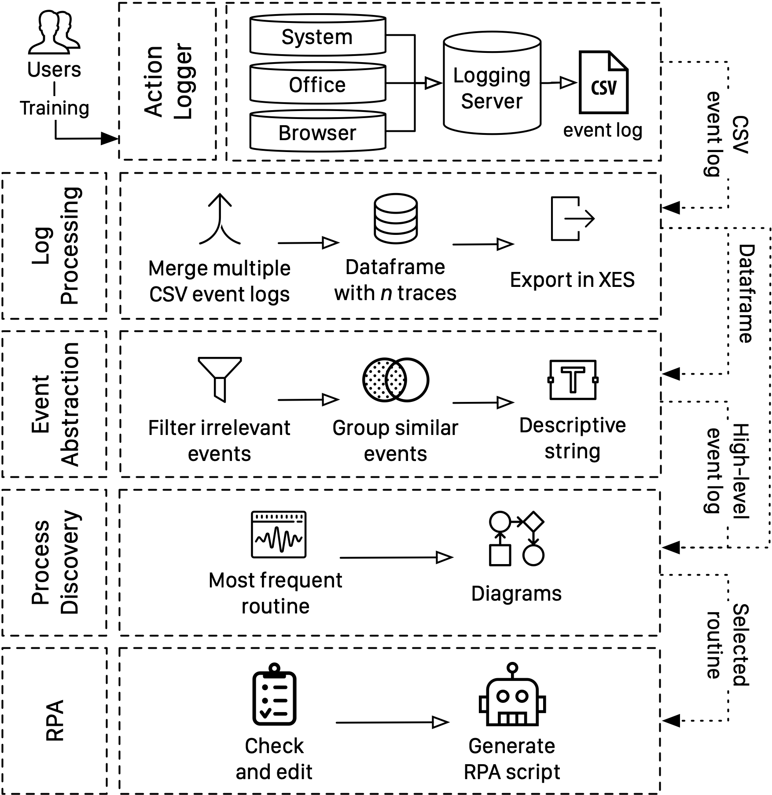
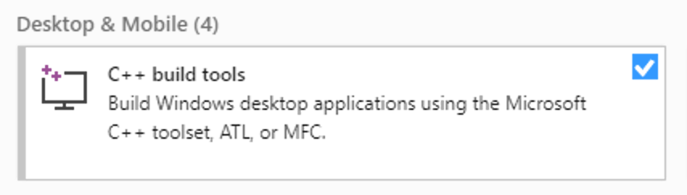

<p align="center">
<br/><br/>
    <a href="https://www.python.org/downloads/" alt="Activity">
        </a>
    <a href="#" alt="Activity">
        </a>
    <a href="#" alt="Activity">
        </a>
    <a href="#" alt="Activity">
        </a>
    </br>
    <a href="https://www.office.com/" alt="Activity">
        </a>
    <a href="https://www.google.com/chrome/" alt="Activity">
        </a>
    <a href="https://www.mozilla.org/en-US/firefox" alt="Activity">
        </a>
    <a href="https://www.microsoft.com/en-us/edge" alt="Activity">
        </a>
    <a href="https://www.opera.com/" alt="Activity">
        </a> 
    <br/>
    <a href="#"></a> 
  <br/><br/>
  

</p>

# What is SmartRPA

**Robotic Process Automation (RPA)** is a technology which automates mouse and keyboard interactions by means of a software (SW) robot to remove intensive routines.
The current generation of RPA tools is driven by predefined rules and manual configurations made by expert users rather than automated techniques.

**SmartRPA** is a cross-platform tool that tackles such issues by automatically generating executable RPA scripts that will drive a SW robots in emulating the users’ most frequent observed behavior (previously recorded in dedicated UI logs) during the enactment of a routine of interest.

The related **paper** is available [here](https://doi.org/10.1007/978-3-030-58779-6_8).

A **screencast** of the tool is available on [Vimeo](https://vimeo.com/marco2012/smartRPA).

# Architecture

The architecture of SmartRPA integrates five main SW components.

<p align="center">
  
</p>

**Key features** include:

- [x] **Action Logger**, log user behaviour, cross-platform, modular, supports wide range of applications;
- [x] **Log Processing**, generates both CSV and XES event log;
- [x] **Event abstraction**, abstracts events to a high level;
- [x] **Process Discovery**, selects the most frequent routine to automate and generates high-level flowchart diagram of such routine thus skipping completely manual modeling;
- [x] **RPA**, implements and enacts a SW robot emulating the best (most frequent) routine reflecting the observed behavior. Available both as a cross-platform Python script and as a UiPath project.

A _partial_ list of features for each module of the Action Logger is available in [`features.pdf`](https://github.com/bpm-diag/smartRPA/blob/master/docs/Features.pdf).

# Installation and execution:

Make sure you are using **_64bit_ version of Python 3.7 or greater** installed from the [official website](https://www.python.org/downloads/).

### 1. **Install dependencies**

- Install **project** dependencies

  ```bash
  pip3 install -r requirements.txt
  ```

- Install **Process Discovery** dependencies

  [Details here](#process-discovery-dependencies)

- Install **RPA** dependencies

  [Details here](#rpa-dependencies)

### 2. **Install browser extension**

The browser extension is required to log browser events. It is available in `extensions/browserlogger` and supports 4 major browsers:

- [_Google Chrome_](https://www.google.com/chrome/): load unpacked `browserlogger` directory in `chrome://extensions/`

- [_Mozilla Firefox_](https://www.mozilla.org/en-US/firefox/new/): load unpacked `browserlogger` directory in `about:debugging#/runtime/this-firefox`

- [_Microsoft Edge (chromium)_](https://www.microsoft.com/en-us/edge): load unpacked `browserlogger` directory in `edge://extensions/`

- [_Opera_](https://www.opera.com/): load unpacked `browserlogger` directory in `opera:extensions`

Once main logger is running, **you must click** on the browser extension to enable it.

### 3. **Install Excel Addin (MacOS Only)**

The excel addin is required to log Excel events <u>only on MacOS</u>.

[`Node.js`](https://nodejs.org/en/download/) must be installed to run this addin.

```bash
cd extensions/excelAddinMac
npm install # install dependencies
npm start   # sideload Add-in
npm stop    # stop server
```

<details>
<summary>
    Click to show how to <b>activate the Add-in</b> in Excel
</summary>
</br>

<ol type="a">
  <li>Start the Action Logger selecting Excel module</li>
  <li>Go to <code>Insert</code> tab</li>
  <li>Click on the small down-arrow to the right of <code>My Add-ins</code> > <code>OfficeLogger</code></li>
  
  <li>Go to <code>Home</code> tab</li>
  <li>Click the <code>Show Taskpane</code> button in the ribbon</li>
  <li>Enable the checkbox</li>
</ol>

If you don't find <code>OfficeLogger</code> under <code>My Add-ins</code>, copy <code>extensions/excelAddinMac/manifest.xml</code> into <code>~/Library/Containers/com.microsoft.Excel/Data/Documents/wef</code>, as described <a href="https://docs.microsoft.com/en-us/office/dev/add-ins/testing/sideload-an-office-add-in-on-ipad-and-mac#sideload-an-add-in-in-office-on-mac">here</a>.

</details>

### 4. **Run main logger**

```bash
python3 main.py
```

The resulting event log will be saved in `/logs` directory.

## Process Discovery dependencies

The following dependencies are required to enable process discovery analysis, a key component of the tool.

#### 0) Visual Studio (Windows Only)



- On **Windows**, [Visual Studio C/C++ Build Tools](https://visualstudio.microsoft.com/en/thank-you-downloading-visual-studio/?sku=BuildTools&rel=16) must be installed.
  It is vital to install all C++ related development tools like:

  - Windows 10 SDK
  - Visual C++ tools for CMake
  - C++ x64/x86 build tools

  If you encounter errors like `Microsoft Visual C++ 14.0 is required`, [check here](https://www.scivision.co/python-windows-visual-c-14-required/).

#### 1) PM4PY

To enable process discovery techniques you must install [PM4PY](https://pm4py.fit.fraunhofer.de/features) python module.

- On **Windows**:

  1. Make sure you installed [Visual Studio C/C++ Build Tools](#0-visual-studio-windows-only).
  2. Install [graphviz-2.38.msi](https://graphviz.gitlab.io/_pages/Download/windows/graphviz-2.38.msi)
  3. Add `C:\Program Files (x86)\Graphviz2.38\bin` folder to [system path](https://stackoverflow.com/a/44272417/1440037)
  4. `pip3 install pm4py==1.2.12`

    </br>
    <details>
    <summary>
        Click to show how to <b>fix installation errors</b> on Windows
    </summary>
    </br>

  If you get the error <code>ERROR: Could not find a version that satisfies the requirement ortools</code> make sure you are using <a href="https://www.python.org/downloads/windows/">64bit version of Python3</a>.

    </details>

- On **MacOS**:

  Use [brew package manager](https://brew.sh/) to install graphviz

  ```bash
  brew install graphviz
  pip3 install pm4py==1.2.12
  ```

    <details>
    <summary>
        Click to show how to <b>fix installation errors</b> on MacOS
    </summary>
    </br>

  If you get an error during installation:

  1. If you're on **MacOS 10.14 Mojave**, run the following command as suggested [here](https://github.com/python-pillow/Pillow/issues/3438#issuecomment-435169249), and then, in the same terminal window, try to install the packages again

     ```
     sudo installer -pkg /Library/Developer/CommandLineTools/Packages/macOS_SDK_headers_for_macOS_10.14.pkg -target /
     ```

  2. If you're on **MacOS 10.15 Catalina**, run the following command as suggested [here](https://github.com/python-pillow/Pillow/issues/3438#issuecomment-543812237), and then, in the same terminal window, try to install the packages again

     ```
     export CPATH=`xcrun --show-sdk-path`/usr/include
     ```

    </details>

#### 2) Python-Levenshtein (Windows Only)

This package provides a 4-10x speedup in String Matching.

- On **Windows**:
  1.  Make sure you installed [Visual Studio C/C++ Build Tools](#0-visual-studio-windows-only)
  2.  `pip3 install python-Levenshtein==0.12.0`

## RPA dependencies

SmartRPA generates two types of SW Robots in the `/RPA` directory:

1. a cross-platform executable **Python script**, available on both Windows and MacOS
2. a **UiPath project**, available only on Windows

The advantages of the UiPath integration is that the generated SW Robot can be easily customized by the end user.

### Python script

The cross-platform python script requires the following dependencies to work.

#### 1) Automagica

To run the generated RPA scripts you must install `automagica` module.

`pip3 install automagica==2.0.25`

  <details>
  <summary>
      Click to show how to <b>fix installation errors</b> on Windows
  </summary>
  </br>

1. Make sure you are using <a href="https://www.python.org/ftp/python/3.8.1/python-3.8.1-amd64.exe">64bit version of Python3</a>
2. Install `Win64 OpenSSL v1.1.1` from <a href="https://slproweb.com/products/Win32OpenSSL.html">this website</a>. When prompted select _"Copy OpenSSL DLLs to: the Windows system directory"_
3. Open CMD as <i>admin</i> and type (one command per line):

```cmd
set LIB=C:\Program Files\OpenSSL-Win64\lib;%LIB%
set INCLUDE=C:\Program Files\OpenSSL-Win64\include;%INCLUDE%
pip3 install automagica==2.0.25
```

</details>

#### 2) Chromedriver

Install chromedriver to enable automation in Google Chrome.

Make sure to install the release that matches your Google Chrome version (check `chrome://settings/help`). A complete list of releases can be found [here](https://pypi.org/project/chromedriver-binary/#history). The command below is for Chrome version 85.

```bash
pip3 install chromedriver-binary==85.0.4183.83.0
```

<details>
<summary>
    Click to show how to <b>fix installation errors</b> on MacOS
</summary>
<br>
If you get the error <code>RuntimeError: Failed to download chromedriver archive</code>

1. Navigate to `/Applications/Python 3.8/` folder
2. Run `Install Certificates.command` file
3. Install the package again

<a href="https://stackoverflow.com/a/42107877">Reference</a>

If you don't find the `Python 3.8` folder under `/Applications`, make sure you installed Python using <a href="https://www.python.org/downloads/mac-osx/">the official installer</a> and not from a package manager like brew.

</details>

### UiPath (Windows Only)

The generated UiPath project requires _UiPath Studio_, available at [https://www.uipath.com/product/studio](https://www.uipath.com/product/studio) .

# Recap

To sum up, you should have installed:

- Action Logger dependencies
  - `pip3 install -r requirements.txt`
  - [Browser extension](#2-install-browser-extension)
  - [Excel AddIn (MacOS Only)](#3-install-excel-addin-macos-only)
- [Process Discovery dependencies](#process-discovery-dependencies)
  - [Visual Studio C/C++ Build Tools (Windows Only)](#0-visual-studio-windows-only)
  - [PM4PY](#1-pm4py)
  - [Python Levenshtein (Windows Only)](#2-python-levenshtein-windows-only)
- [RPA dependencies](#rpa-dependencies)
  - [Python script](#python-script)
    - [Automagica](#1-automagica)
    - [Chromedriver](#2-chromedriver)
  - [UiPath](#uipath-windows-only)

If you have everything installed, you can [run the tool](#4-run-main-logger) (`python3 main.py`).
